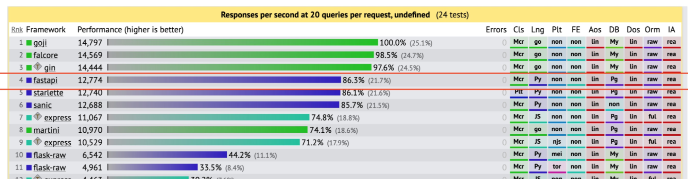

## FastAPI란?
- FastAPI는 현대적이고,빠르며(고성능), 파이썬 표준 타입 힌트에 기초한 python 의 API를 빌드하기 위한 웹 프레임워크이다.

### FastAPI의 특징
- 빠르다: (Starlette과 Pydantic 덕분에)NodeJS 및 Go와 대등할 정도로 매우 높은 성능 및 비동기 처리에 최적화되어 있음
    - 동기와 비동기의 차이: 
        - 동기(Synchronous): 한 번에 한 흐름으로 진행,어떤 작업을 호출하면 끝날 떄까지 다음 줄로 못 넘어감
        - 비동기(Asynchronous): 어떤 작업을 시작해두고 기다리는 동안 다른 일을 처리할 수 있다(async/await 사용)
    - Starlette: FastAPI 에서의 웹 프레임워크 엔진 라이브러리
    - Pydantic: 파이썬 타입 힌트 기반 데이터 검증/변환을 해주는 라이브러리
    
- 적은 버그: 사람에 의한 에러 약 40% 감소
- 쉬움: 쉽게 사용하고 배우도록 설계, 적은 문서 읽기 시간.
- 짧음: 코드 중복 최소화, 각 매개변수 선언의 여러 기능 적은버그
- 표준기반: API에 대한 개방형 표준 기반 

### FastAPI의 세팅방법
```python 
from fastapi import FastAPI

app = FastAPI()

@app.get("/")
def read_root()-> dict[str,str]:
    return {
        "hello":"world"
    }

@app.get("/items/{item_id}")
def read_item(item_id:int,q:str | None = None):
    return {"item_id":item_id,"q":q}


